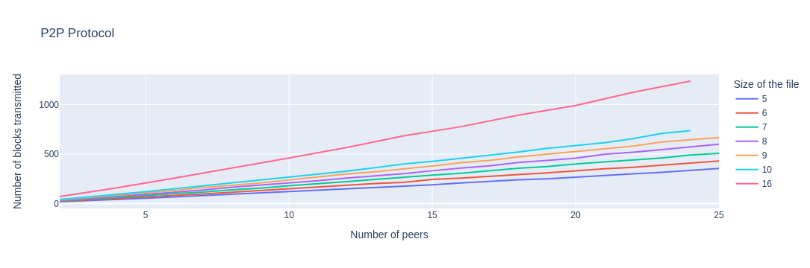
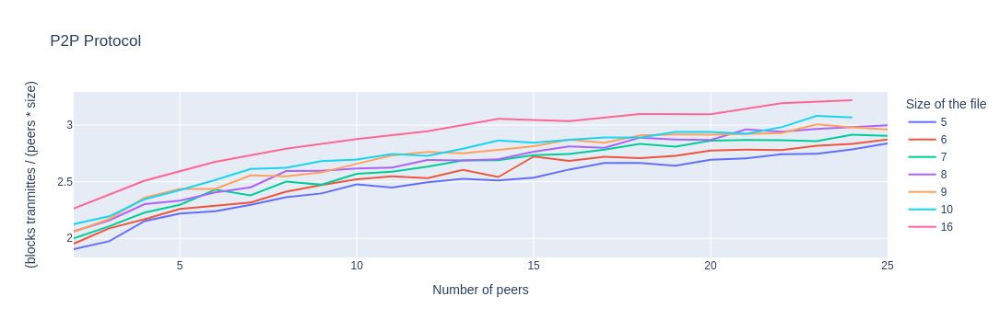
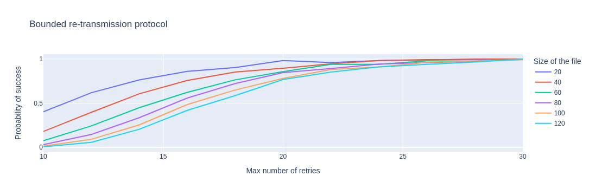

# Case studies

## About simulations

The experiments reported here were performed on a Dell 3430 with 64GB RAM and
6-Core Intel Xeon 4500MHz.  PVeStA was executed with 10 Java processes, using
as parameter alpha=0.01. File `results.odt` contains a sheet with the results
for each system.

## Gear System

The file `gear-system.b` contains the probabilistic model of the controller for
a landing gear system presented in [1]. The property `doors=open` returns 0.0
(i.e., the doors of the system are always closed after the end of the sequences). 
The probability of ending the sequence of actions with the gear retracted (property
`gear=retracted`) is 0.49. This is explained by the fact that the event `pcmd`
may change the value of the handle to up and down with equal probability.

## Brake System

The emergency brake system modeled in [2] can be found in `brake-system.b`.

## P2P Protocol

The file `p2p-protocol.b` presents an alternative model to the one reported in
[3]. Instead of representing the file to be sent as  a matrix of type `1..N x
1..K -> {emp, ok, download}` where `N` is the number of clients and `K` is the
number of blocks, here the file is a function `0.. N*K-1 -> {emp, ok,
download}`. Consistently, `i -> S` represents that the block `i/N` of the
client `i mod N` is currently in state `S`. The file `results.odt` reports the
expected number of times a block needs to be (re)transmitted (due to failures)
for different values of `N` and `K`. The plots below show the expected value
for the number of blocks transmitted.

## Bounded re-transmission protocol

The files `b-retrans-4.b` and `b-retrans-5.b` present, respectively, the fourth
and fifth refinements of the bounded re-transmission protocol modeled in
Event-B in [4, Chapter 6]. This model is not probabilistic but the fifth
refinement introduces events for changing the state of the activation bits,
thus simulating failures. After a number `MAX` of retries, the sender and the
receiver end the protocol in state `failure`. By assigning the same weight to
the different events of the system, the model becomes probabilistic. The file
`results.odt` reports the expected probability of ending the protocol in state
`success` for different values of `MAX`. 

## References
[1]  Aouadhi, M.A., Delahaye, B., Lanoix, A.: A Fully Probabilistic Extension
of Event-B. Research report, LINA-University of Nantes (Jan 2016).

[2]  Aouadhi, M.A., Delahaye, B., Lanoix, A.: Moving from Event-B to
Probabilistic Event-B. Research report, LINA-University of Nantes (Apr 2016).

[3] Aouadhi, M.A., Delahaye, B., Lanoix, A.: Introducing probabilistic
reasoning within Event-B. Softw. Syst. Model. 18(3), 1953–1984 (2019)

[4] Jean-Raymond Abrial: Modeling in Event-B - System and Software Engineering.
Cambridge University Press (2010)

