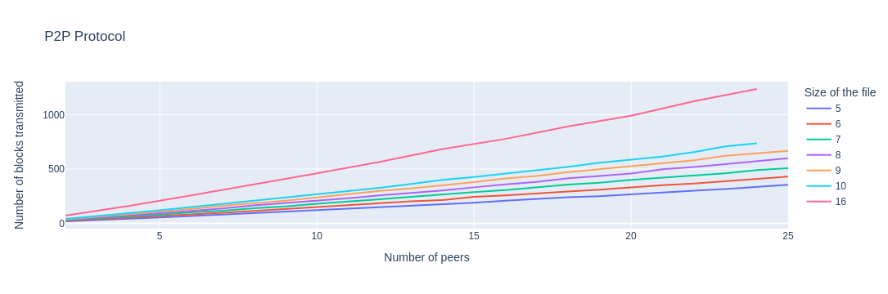
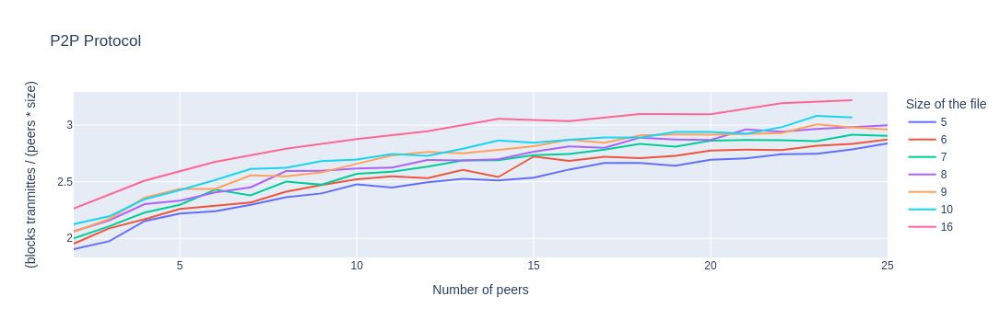
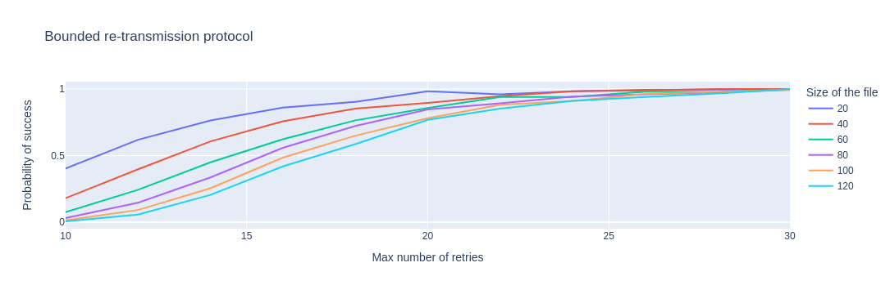
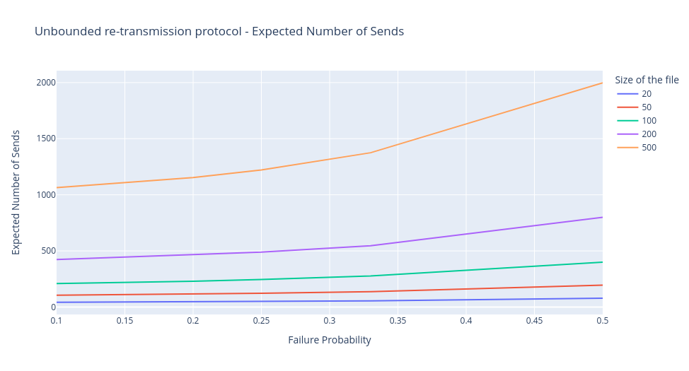
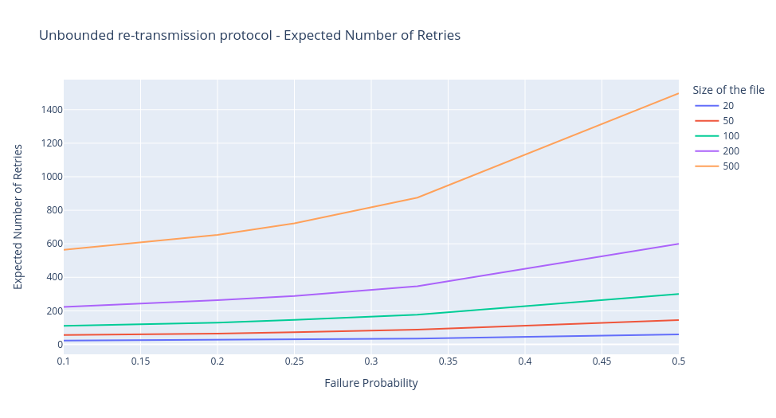
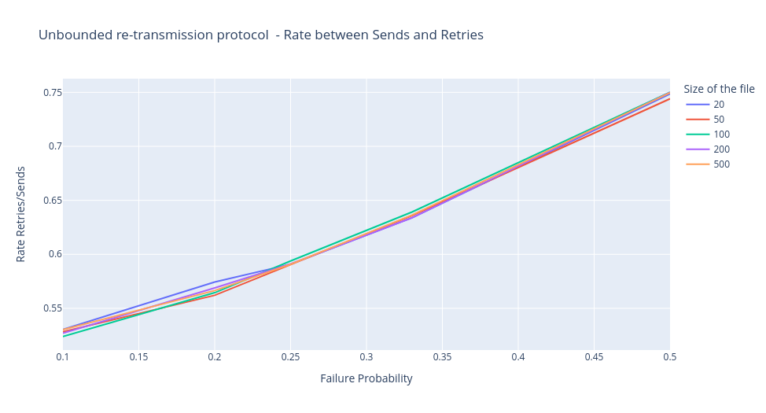
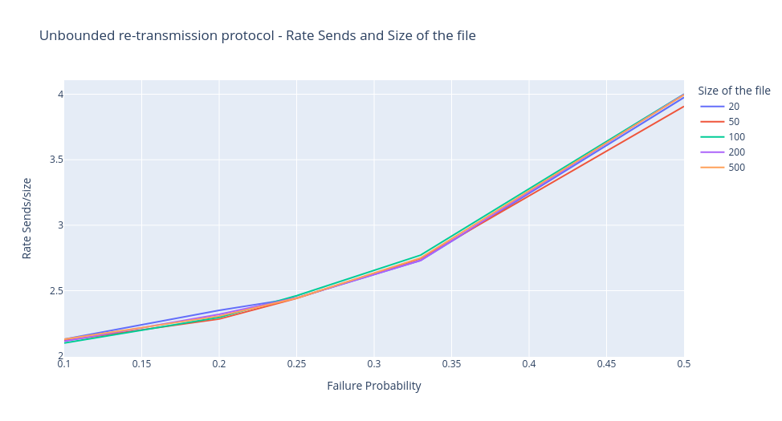
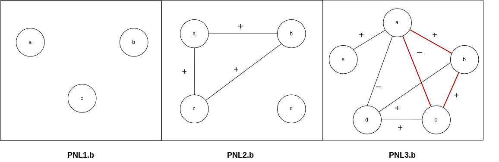

# Case studies

## Properties 

In each case study, the section `PROPERTIES` of the Event-B files includes
properties that can be verified. In all the cases, the invariant of the 
machine is added to this section and it can be verified using the `search`
command of Maude (see some examples below). 

The experiments for stochastic model checking reported here were performed on a
Dell 3430 with 64GB RAM and 6-Core Intel Xeon 4500MHz. File `results.odt`
contains several experiments for the case studies. 

## Gear System

(Directory `mechanical-systems`). The file `gear-system.b` contains the
probabilistic model of the controller for a landing gear system presented in
[1]. The experiment allows for answering the following questions:
* What is the probability of ending the maneuver with the doors open (property
  `doors=open`)? The The answer is 0.0, i.e., the doors of the system are
  always closed after the end of the sequences.
* What is the probability of ending the maneuver with the gear retracted
  (property `gear=retracted`)? The answer is 0.49. This is explained by the
  fact that the event `pcmd` may change the value of the handle to up and down
  with equal probability.


The invariant of this system is `cmd <= FCMD` and the parser generates
the following definition:

```
eq prop(4,   
   < $$CNAME : Context | sets : ($$Sets), 
     constants : ('FCMD |-> $$FCMD) >  
   < $$MNAME : Machine | variables : ('handle |-> $$handle , 
               'gear |-> $$gear , 'door |-> $$door , 
               'cmd |-> $$cmd), events : $$SEv > ) 
  = toFloat((($$cmd) <= ($$FCMD))) .
```

This invariant can be checked with the following command: 

```
Maude> search initState =>* SYS such that  not SYS |= prop(4) .
search in ctxGearSystem : initState =>* SYS such that not SYS |= prop(4) = true .

No solution.
states: 338  rewrites: 13165 in 9ms cpu (11ms real) (1333569 rewrites/second)
```

The answer `No solution` means that all the reachable states satisfy the invariant. 

## Brake System

(Directory `mechanical-systems`).The emergency brake system modeled in [2] can
be found in `brake-system.b`. 

## P2P Protocol

(Directory `p2p-protocol`). The file `p2p-protocol.b` presents an alternative
model to the one reported in [3]. Instead of representing the file to be sent
as  a matrix of type `1..N x 1..K -> {emp, ok, download}` where `N` is the
number of clients and `K` is the number of blocks, here the file is a function
`0.. N*K-1 -> {emp, ok, download}`. Consistently, `i -> S` represents that the
block `i/N` of the client `i mod N` is currently in state `S`. 

The key property in this system is to estimate the total number of blocks that
need to be transmitted in order to complete the download in all the clients.
The file `results.odt` reports the expected number of times a block needs to be
(re)transmitted (due to failures) for different values of `N` and `K`. The
plots below show the expected value for the number of blocks transmitted.





## Bounded re-transmission protocol

(Directory `bounded-retransmission-protocol`). The files `b-retrans-4.b` and
`b-retrans-5.b` present, respectively, the fourth and fifth refinements of the
bounded re-transmission protocol modeled in Event-B in [4, Chapter 6]. This
model is not probabilistic but the fifth refinement introduces events for
changing the state of the activation bits, thus simulating failures. After a
number `MAX` of retries, the sender and the receiver end the protocol in state
`failure`. By assigning the same weight to the different events of the system,
the model becomes probabilistic. 

The relevant property here is to determine the probability of successfully
completing the protocol or, alternatively, estimate the number of retries that
guarantee that the file is transmitted with a reasonable probability of
success. The file `results.odt` reports the expected probability of ending the
protocol in state `success` for different values of `MAX`. The simulations show
that 26 retries are enough to complete the protocol with a probability higher
than 0.94 (for the given size of files). 



The invariant of this system is specified in the section `PROPERTIES`. 

### Unbounded re-transmission protocol

The file `b-retrans-5-no-retry.b` presents a alternative version of the
re-transmission protocol discussed previously, where there are no limits for
the number of retries. Consequently, the sender will try to send the file until
the protocol is completed. 

The property of interest here is to estimate the number of blocks that need to
be (re)transmitted before ending the protocol. The file `results.odt` reports
the expected value of the number of blocks that need to be sent to complete the
transmission depending on the reliability of the communication channel (by
modifying the weight of the events modeling the failure). 



Additionally, it is reported the expected value of the number of times that was
necessary to re-send a package, the expected value of the rate between re-sends
and total sends and the expected value of the rate between total sends and the
size of the file. This last measure stands for the times that in average a
package must be sent. Note that when the probability of failure of the channel
is fixed, the ratio between the total number of blocks transmitted and the
number of retries is constant. Of course, such a ratio increases when the
probability of failure of the channel is higher: 







## Local Balance Property in Signed Frames

(Directory `consensus-PNL`). Positive negative logic or PNL is a modal logic
introduced in [5, 6], used to define properties over a specific class of
network represented as signed frames. In [5], an extension of PNL is proposed
where the modalities $\langle \bigwedge\mkern-12mu\bigwedge + \rangle$ and
$\langle \bigwedge\mkern-12mu\bigwedge - \rangle$ randomly add positive and
negative links to the network. To represent this behavior, an Event-B model
that specifies an initial signed frame and non-deterministically adds positive
and negative links until reaching a complete graph, was implemented in the
files `PNL1.b`, `PNL2.b` and `PNL3.b`. The initial signed frames for each one
of the 3 models can be seen in the following image: 

 

The main property that wants to be verified is whether or not the final state
of the system satisfies the local balance property (Definition 2.5 in [5]) over
signed frames. The obtained results for each one of the experiments correspond
to the expected probability of reaching a terminating state, i.e. a complete
graph, with the local balance property, given the initial configuration of the
three experiments. These results can be found in the `results.odt` file.


## Non probabilistic models

(Directory `B-book-models`). Some other example include non-probabilistic
models from the Event-B book [4]. Those models become probabilistic by
assigning the same weight to all the events. These models include: 
 * Controlling cars on a bridge (Chapter 2)
 * A mechanical press controller (Chapter 3)
 * A simple file transfer protocol (Chapter 4)
 * A Bounded re-transmission protocol (Chapter 6) (see directory `bounded-retransmission-protocol`)
 * Development of a concurrent program (Chapter 7)

## References
[1]  Aouadhi, M.A., Delahaye, B., Lanoix, A.: A Fully Probabilistic Extension
of Event-B. Research report, LINA-University of Nantes (Jan 2016).

[2]  Aouadhi, M.A., Delahaye, B., Lanoix, A.: Moving from Event-B to
Probabilistic Event-B. Research report, LINA-University of Nantes (Apr 2016).

[3] Aouadhi, M.A., Delahaye, B., Lanoix, A.: Introducing probabilistic
reasoning within Event-B. Softw. Syst. Model. 18(3), 1953–1984 (2019)

[4] Jean-Raymond Abrial: Modeling in Event-B - System and Software Engineering.
Cambridge University Press (2010)

[5] M. Young Pedersen, S. Smets, T. Ågotnes: Modal Logics and Group Polariza-
tion. Journal of Logic and Computation (2021).

[6] Z. Xiong, T. Ågotnes: On the logic of balance in social networks. Journal of
Logic, Language and Information (2020).

